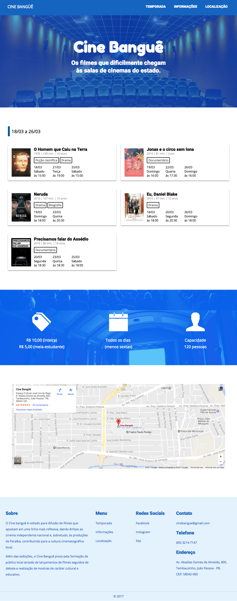
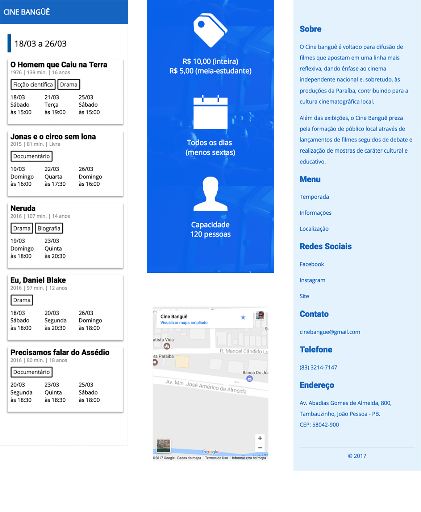

# Cinebangue

## DESCRIÇÃO
---

Digamos que o pessoal do Cine Banguê, procurou o IFPB para criar uma página Web do seu cinema, a princípio com uma proposta de protótipo para desktop baseada na *Figura 1*.

*Figura 1 - Layout da página em 1260px* 

Contudo, dado o destaque e quantidade de acesso por meio de dispositivos móveis, uma das exigências é que o site deve ter uma visualização adequada para esses dispositivos. Tal como a *Figura 2*.

*Figura 2 - Layout da página em 375px* 

Então baseado nessa necessidade, um desenvolvedor chegou a codificar alguns recursos necessários no layout da página Web inspirados na *Figura 1* e *Figura 2*, e que seu resultado está disponível no arquivo [code.zip](code.zip). Portanto, cabe a você para continuar o desenvolvimento através das questões que serão levantadas a seguir, e cada questão tem explicito sua forma de pagamento.

Resumidamente o layout é dividido em algumas áreas: a barra de navegação, o cabeçalho da página, a área principal de conteúdo e o rodapé da página. Cada uma dessas áreas apresentam itens com aparências específicas, que devem ser preservados o mais próximo possível do comportamento  estrutural e do estilo apresentado.

Para facilitar esse processo de desenvolvimento, cada questão abordará um item específico, no qual seu conteúdo será previamente disponibilizado por meio dos arquivos obtidos com o desenvolder. Por exemplo, uma das questões solicitará a criação e estilização da barra de menu, e como ponto de partida, os arquivos baixados já oferecem algum conteúdo, para que assim seja utilizado por você na criação da barra.

## QUESTÕES
---

**QUESTÃO 1 -** No Layout apresentado do Cine Bangue é possível identificar a barra de menu do site. Através dos arquivos obtidos, veja que o layout apresenta o HTML necessário, contudo falta o CSS da barra, então, crie a aparência da barra de menu conforme a *Figura 1* considerando que:

**a.** O logotipo da página deve ser colocado na tag `` através de geração de conteúdo via CSS em `/* TODO logo */`, ou seja, não é para mudar o HTML;

**b.** A barra de menu fique fixa no topo do viewport no CSS em `/* TODO nav fixed */`, lembrando que a cor dela é `#1565C0`;

**c.** Faça uma transição da cor de borda inferior dos links nos menus da página em `/* TODO transition border-color link */` conforme a *Figura 3*.

*Figura 3 - Esquema da transição dos links no menu.* 

**QUESTÃO 2 -** Veja a *Figura 2* e aplique a responsividade na página de modo que:

**a.** O menu na barra de navegação seja oculta quando a resolução for menor que 899px em `/* TODO menu-inline hidden viewport < 899px */`;

**b.** Oculte o cabeçalho quando a página possuir resolução menor que 899px em  `/* TODO header hidden viewport < 899px */`;

**c.** Crie uma responsividade na exibição dos filmes de modo que em resoluções inferioes à 500px a imagem do filme seja ocultado em `\* TODO movie responsive viewport < 500px */`, e em `/* TODO movie responsive */` faça que os filmes sejam exibidos dois a dois em resoluções acima de 1200px;

**d.** Crie em `/* TODO info responsivo */` uma visualização dos dados de `#info` em linha para resoluções superiores à 900px, e para resoluções infereiores exiba-os em bloco;

**e.** Em `/* TODO footer responsivo */` faça que o rodapé exiba as informação conforme a *Figura 1* nas resoluções superioes à 900px.

**QUESTÃO 3 -** Veja a *Figura 1* e coloque a localização do cinema através do mapa do Google Maps, para isso adicione o HTML necessário em `<!-- TODO location -->` e o CSS necessário em `/* TODO location */`.

> *[Alternativa de resposta](code-response/).*