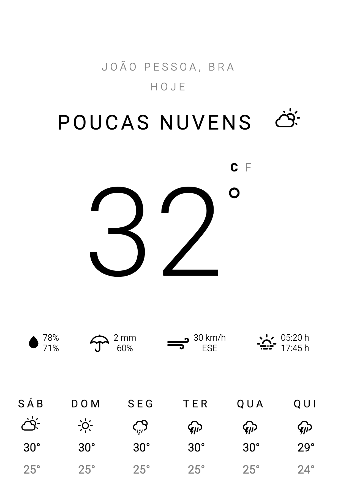
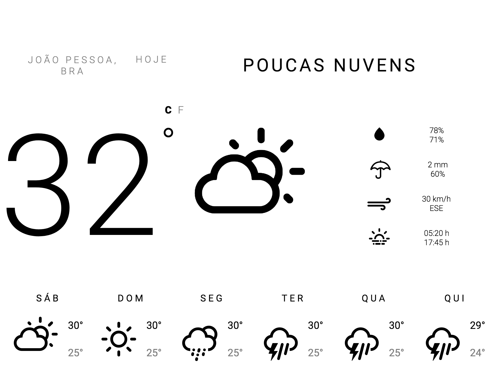

# Weather Responsive

## DESCRIÇÃO
---

Um grupo de ciclistas estava procurando uma aplicação Web para facilitar o acompanhamento das condições climática de João Pessoa, mas que fosse simples e com a aparência limpa.

Como a princípio os ciclistas preferem o acesso via celular, então um *designer* modelou a [página Web](code.zip) conforme a *Figura 1*, e estava precisando da ajuda de um desenvolvedor Front-end para tornar a página responsiva.

*Figura 1 - Site da previsão do tempo (Versão Mobile)* 
<!--  -->

A responsividade deve prever mais duas visualizações, uma entre `500px` e `999px`, já outra acima de `1000px`. Respectivamente a visualização deve ser semelhante a *Figura 2* e ao da *Figura 3*.

*Figura 2 - Site da previsão do tempo (Versão Tablet)* 
<!--  -->

*Figura 3 - Site da previsão do tempo (Versão Desktop)* 

Pensando em facilitar a programação da resposividade o *designer* planejou as seguintes questões.

## QUESTÕES
---

**QUESTÃO 1 (50%)** - Crição da responsividade da versão Tablet, conforme a *Figura 2*

**QUESTÃO 2 (50%)** - Crição da responsividade da versão Tablet, conforme a *Figura 3*

> [Alternativa de resposta](code-response/).
