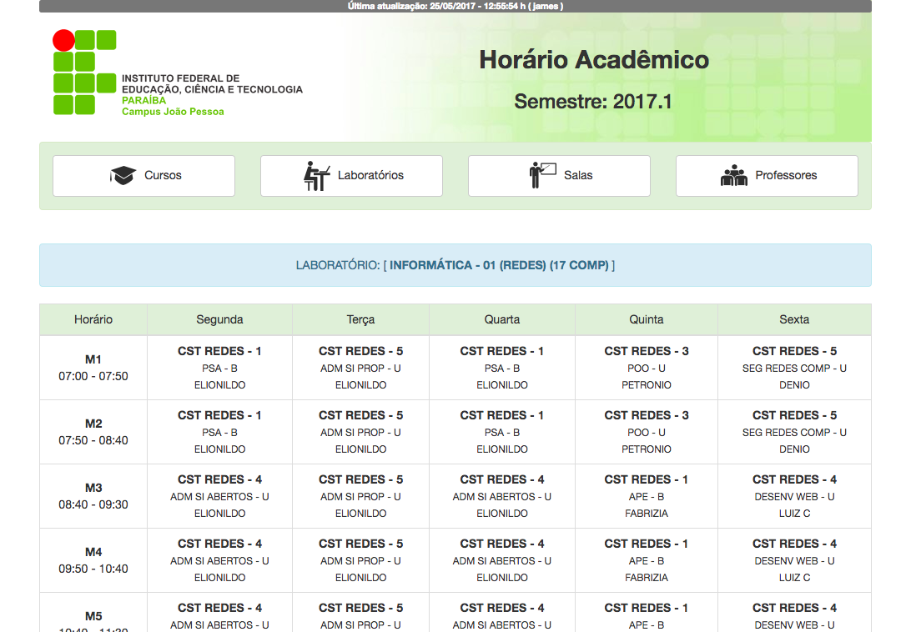
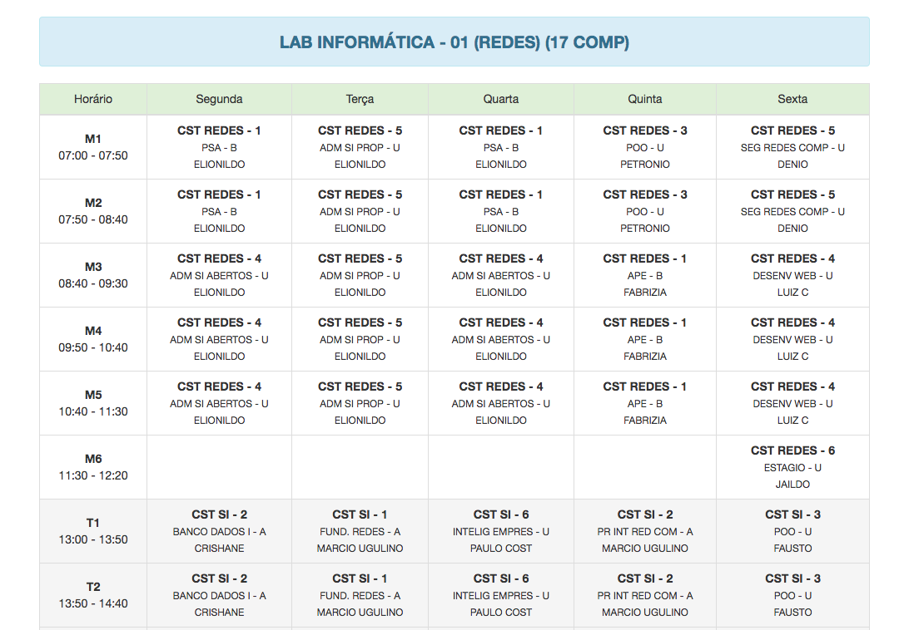

# Analisando Estilo de uma Página da Web

## Objetivo

O objetivo desta atividade consiste em abordar os seguintes temas:

- Edição da cópia de uma página usando a Ferramenta de Desenvolvedor do Browser
- Analisar e editar estilos de um elemento HTML

## Descrição

A Ferramenta de Desenvolvedor, abordado no exercício sobre [Analisando uma página Web](https://ifpb.github.io/html-exercises/challenges/inspect-page/), pode permitir a edição da estrutura da página carregada.

Para experimentar este recurso acesse o horário de algum laboratório do IFPB, nessa [página](http://joaopessoa.ifpb.edu.br/horario/), e através da Ferramenta de Desenvolvedor remova da página em memória, apresentado na *Figura 1*, alguns elementos de cabeçalho da página para que assim reste apenas o título do laboratório e sua tabela dos horários, conforme a *Figura 2*.

*Figura 1* - Horário Original do Lab 01 2017.1

*Figura 2* - Horário Personalizado do Lab 01 2017.1

Mas, essa ferramenta também pode ser usada para analisar e editar os estilos aplicados sobre as tags.

Portanto, tente analisar o estilo das tags seleciondas, inclusive, veja que é possível alterar o estilo em memório, por exemplo, tente alterar apenas o tamanho do nome do laboratório na própria ferramenta.

Detalhe, também é possível verificar se foi editado ou carregado uma propriedade ou valor com valor inválido. Na aba `Elements` a seção `Styles` a declaração inválida geralmente fica com algum ícone de alerta.

Contudo, veja que ao fazer o recarregamento da página as configurações editadas são perdidas, pois a edição é feita apenas na cópia corrente.

Para testar este recurso em outro site, tente, por exemplo, mudar algumas cores de texto cinza desta [página](https://docs.emmet.io/cheat-sheet/) para branco.
