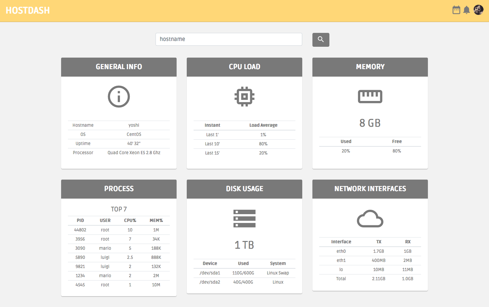
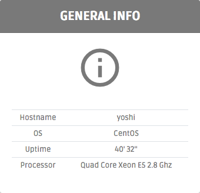
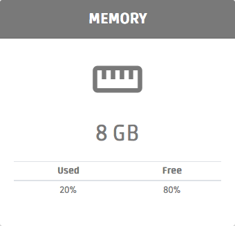
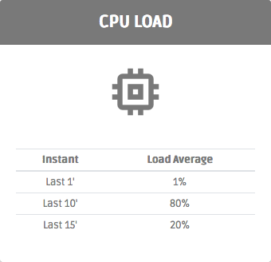
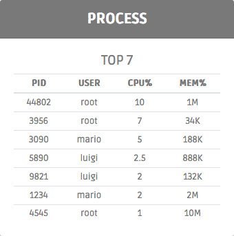
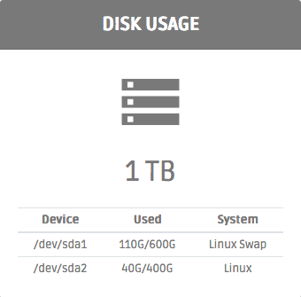
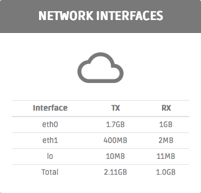

# Host Monitor

## DESCRIÇÃO
---

Considere que o IFPB está com uma demanda técnica relacionado ao monitoramento de algumas máquinas, no qual foi exigido realizar exibir algumas métricas como status da CPU, memória, processos, disco, rede etc. Ao analisar o mercado foi possível encotrar muitos ferramentas que atendiam essa demanda. 

Como as métricas já eram pré-definidas, logo uma opção considerada interessante foi a aplicação Web open source
[Linux Dash](https://github.com/afaqurk/linux-dash), contudo foi solicitado que houvesse uma adaptação em sua interface para se assemelhar ao template [DashGum Free Dashboard](http://blacktie.co/2014/07/dashgum-free-dashboard/).

Então, diante dessa problemática, a DTI abriu um processo de seleção com os alunos do IFPB para recrutar alguém com domínio no tema, e que pudesse criar o sistema de monitoramento Web.

A princípio foi disponibilizado um layout de como seria o sistema neste arquivo, o [code.zip](code.zip), em uma versão bem inicial já inicializada por um funcionário do setor, mas, a ideia é que no final a página fique semelhante ao da *Figura 1*. Portanto, cabe a você candidato continuar o desenvolvimento através das questões que serão levantadas a seguir.

*Figura 1 - Layout da página*<br>


Resumidamente o layout é dividido em duas áreas principais, o cabeçalho e a área principal de conteúdo. Cada uma dessas áreas apresentam itens com aparências específicas, que devem ser preservados o mais próximo possível do comportamento  estrutural e do estilo apresentado na Figura 1.

Para facilitar esse processo, o desenvolvimento será distribuido em **componentes** e alguns conteúdos serão previamente disponibilizados por meio do arquivo obtido, por exemplo, um dos componentes será o painel de informações do Host selecionado, e como ponto de partida, o arquivo `index.html` oferece em `TODO Painel de Informações Gerais` os dados a seguir:

> General Info<br>
> material-icons info_outline<br>
> Hostname	yoshi<br>
> OS	CentOS<br>
> Uptime	40' 32''<br>
> Processor	Quad Core Xeon E5 2.8 Ghz<br>

para que seja utilizado na criação da estrutura do HTML e estilização do CSS do painel. Também é imporante destacar que `material-icons` se refere aos ícones do [Material Icons](https://material.io/icons/).

## COMPONENTES
---

**COMPONENTE 1 -** Crie o conteúdo do Painel de Informações Gerais, no arquivo [`code/index.html`](code/index.html), especificamente em `TODO Painel de Informações Gerais`:

```html
<!--
  TODO Painel de Informações Gerais
  General Info
  material-icons info_outline
  Hostname	yoshi
  OS	CentOS
  Uptime	40' 32''
  Processor	Quad Core Xeon E5 2.8 Ghz
-->
```

mas considerando que:

* O painel será construíndo usando um `card` do [Bootstrap](http://getbootstrap.com) que ocupará 1/3 do `main`;
* O `card` deve centralizar o alinhamento do texto, sua altura mínima deve ser de `330px`, a sobra de borda de `0 2px 1px rgba(0, 0, 0, 0.2)`, e não deve possuir borda;
* Quando o cursor estiver sobre o `card`, a sobra de borda deve ser `2px 3px 2px rgba(0, 0, 0, 0.3)`;
* O cabeçalho do `card` deve possuir cor de plano de fundo com `#797979`, a cor de texto branca, o texto em negrito,  e o tamanho de fonte 30% maior que o elemento raiz;
* O seu ícone deve possuir tamanho de `6rem` e margem inferior de `2rem`;
* A tabela não deve possuir margem e suas células deve possuir um recuo interno de `.2rem`;
* O painel deve apresentar a aparência conforme a *Figura 2*:

*Figura 2 - Painel de informações dos hosts.*<br>


**COMPONENTE 2 -** Crie o conteúdo do Painel de Carga da CPU, no arquivo [`code/index.html`](code/index.html), especificamente em `TODO Painel de Carga da CPU`:

```html
<!--
  TODO Painel de Carga da CPU
  cpu load
  material-icons memory
  Instant	Load Average
  Last 1'	1%
  Last 10'	80%
  Last 15'	20%
-->
```

mas considerando que:

* O componente deve receber o mesmo estilo da tabela e do `card` no **COMPONENTE 1**;
* O seu ícone deve possuir tamanho de `6rem` e margem inferior de `2rem`;
* O painel deve apresentar a aparência conforme a *Figura 3*:

*Figura 3 - Painel sobre a Carga da Memória.*<br>


**COMPONENTE 3 -** Crie o conteúdo do Painel de Carga da Memória, no arquivo [`code/index.html`](code/index.html), especificamente em `TODO Painel de Carga da Memória`:

```html
<!--
  TODO Painel da Carga da Memória
  memory
  material-icons straighten
  8 GB
  Used	Free
  20%	80%
-->
```

mas considerando que:

* O componente deve receber o mesmo estilo da tabela e do `card` no **COMPONENTE 1**;
* O seu ícone deve possuir tamanho de `6rem` e margem inferior de `1rem`;
* O tamanho total da memória deve possuir tamanho de `2rem` e margem inferio de `1rem`;
* O painel deve apresentar a aparência conforme a *Figura 4*:

*Figura 4 - Painel sobre a Carga da CPU.*<br>


**COMPONENTE 4 -** Crie o conteúdo do Painel dos processos TOP 7, no arquivo [`code/index.html`](code/index.html), especificamente em `TODO Painel dos processos TOP 7`:

```html
<!--
  TODO Painel dos processos TOP 7
  process
  top 7
  PID	USER	CPU%	MEM%
  44802	root	10	1M
  3956	root	7	34K
  3090	mario	5	188K
  5890	luigi	2.5	888K
  9821	luigi	2	132K
  1234	mario	2	2M
  4545	root	1	10M
-->
```

mas considerando que:

* O componente deve receber o mesmo estilo da tabela e do `card` no **COMPONENTE 1**;
* O Título `TOP 7` deve possuir tamanho de `1.2rem`;
* O painel deve apresentar a aparência conforme a *Figura 5*:

*Figura 5 - Painel sobre os Processos TOP 7.*<br>


**COMPONENTE 5 -** Crie o conteúdo do Painel do Uso do Disco, no arquivo [`code/index.html`](code/index.html), especificamente em `TODO Painel do Uso do Disco`:

```html
<!--
  TODO Painel do Uso do Disco
  disk usage
  material-icons storage
  1 TB
  Device	Used	System
  /dev/sda1	10G/100G	Linux Swap
  /dev/sda2 *	40G/400G	Linux
  /dev/sda3	100G/500G	Linux
-->
```

mas considerando que:

* O componente deve receber o mesmo estilo da tabela e do `card` no **COMPONENTE 1**;
* O seu ícone deve possuir tamanho de `6rem` e margem inferior de `1rem`;
* O tamanho total da memória deve possuir tamanho de `2rem` e margem inferio de `1rem`;
* O painel deve apresentar a aparência conforme a *Figura 6*:

*Figura 6 - Painel sobre o Uso do Disco.*<br>


**COMPONENTE 6 -** Crie o conteúdo do Painel de Intefaces, no arquivo [`code/index.html`](code/index.html), especificamente em `TODO Painel de Intefaces`:

```html
<!--
  TODO Painel de Interfaces
  network interfaces
  material-icons cloud_queue
  Interface	TX	RX
  eth0	1.7GB	1GB
  eth1	400MB	2MB
  lo	10MB	11MB
  Total	2.11GB	1.0GB
-->
```

mas considerando que:

* O componente deve receber o mesmo estilo da tabela e do `card` no **COMPONENTE 1**;
* O seu ícone deve possuir tamanho de `6rem` e margem inferior de `1rem`;
* O tamanho total da memória deve possuir tamanho de `2rem` e margem inferio de `1rem`;
* O painel deve apresentar a aparência conforme a *Figura 7*:

*Figura 7 - Painel sobre o Uso da Rede.*<br>


> **[Alternativa de resposta](code-response/)**
