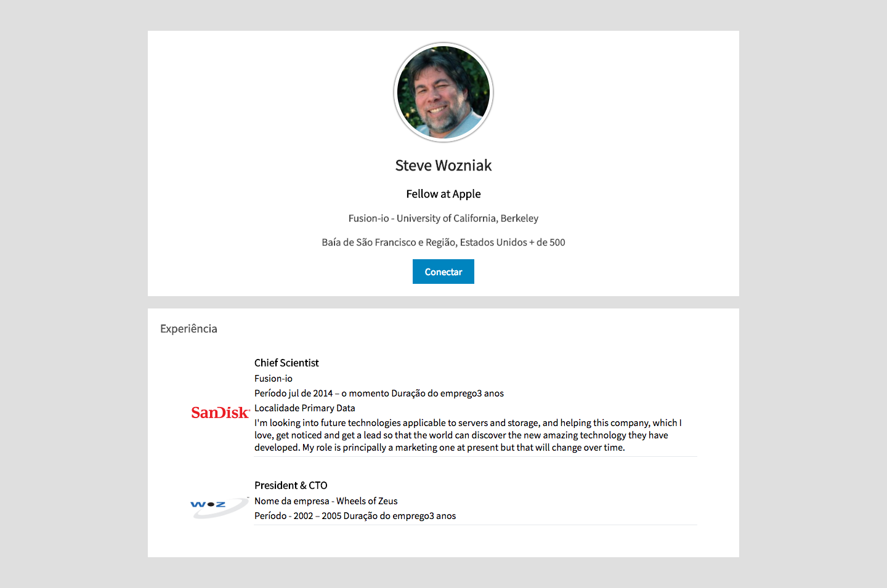

# Curriculum Vitae Estilizado

## Objetivo

* * *

O objetivo desta atividade consiste em abordar os seguintes tópicos:

- Centralizando o conteúdo de uma página
- Alinhar e dimensionar elementos de bloco
- Aplicando recúo interno e margens em blocos para efeitos de estética e layout
- Criar efeito de imagens arredondadas com CSS
- Estruturando e estilizando conteúdos em tabelas
- Usar as propriedades: `color`, `font-family`, `font-size`, `text-align`, `width`, `padding`, `margin`, `padding`, `box-shadow`, `border-box`, `background-color`, `border-radius`, `table`
  
## Descrição

* * *

O Steve Wozniak gostaria de criar seu Curriculum Vitae com aparência *flat design*, a princípio ele forneceu, textualmente, algumas informações que estão disponíveis no arquivo [site](site.zip). Nele encontram-se sua foto e algumas descrições, que juntos deverão ser apresentados em um navegador Web, conforme ilustra a *Figura 1*.

*Figura 1* - Layout do Currículum com Estilo


Para alcançar tal propósito tente adicionar alguns estilos sugeridos a seguir por meio da linguagem CSS. **Obs.:** Os arquivos e diretórios do site apresentam a estrutura a seguir:

```
site
├── css
│   └── style.css
├── img
|   ├── sandisk.jpg
|   ├── steve.jpg
│   └── woz.png
└── index.html
```

As instruções passadas para gerar o currículos, conforme a *Figura 1*, são:

**INSTRUÇÃO 1.** Faça que o corpo do HTML tenha a cor de plando de fundo de `#dfdfdf` e o tipo de fonte com Source Sans Pro, da família do sans-serif.

**INSTRUÇÃO 2.** A área de id `main` deve possui largura fixa de `960px` e margem com valor de `50px auto`.

**INSTRUÇÃO 3.** Todas as seções marcadas com &lt;section> devem possuir cor de plano de fundo branca, recúo interno de `20px` e margem de `20px 0`.

**INSTRUÇÃO 4.** A região de classe `cover` deve centralizar todo o seu conteúdo, já a imagem contida nela deve possuir aparência arredondada, com larguda de `150px`, borda solida e branca com `5px` de largura, e uma sombra de borda com o seguinte valor `0px 0px 2px 2px rgba(0, 0 , 0, .4)`;  

**INSTRUÇÃO 5.** Na região de classe `profile-detail`, as tabelas devem ser centralizada, com uma largura de 90% e margem inferior de `30px`;

**INSTRUÇÃO 6.** Também na região de classe `profile-detail`, a célula de classe `title` deve possuir tamanho de `1.1em` e largura de `90%`. Já a célula de classe `last-cell` deve possuir um recúo interno inferior de `5px` e bordar inferior de `1px solid #e6e9ec`.

> [Alternativa de resposta](site-response/index.html).