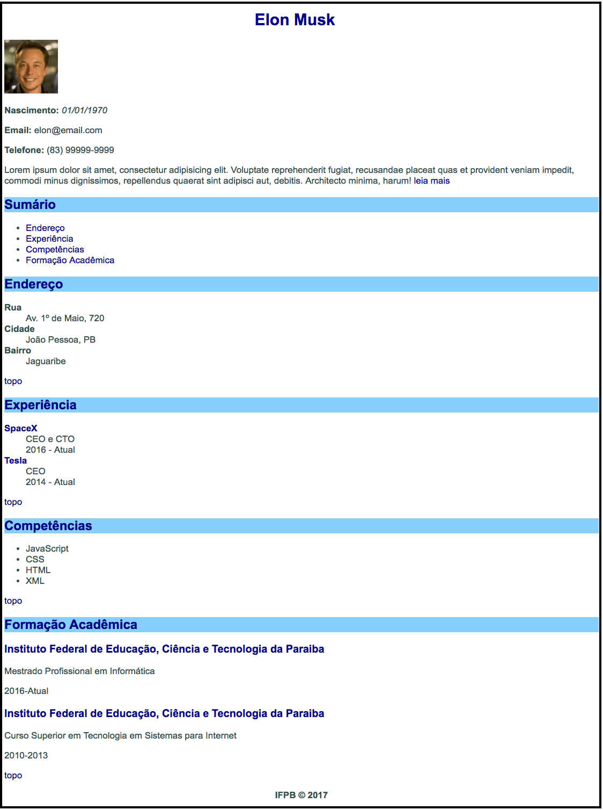

# Curriculum Vitae com Estilo

## Objetivo

O objetivo desta atividade consiste em abordar os seguintes temas:

- Reuso de CSS com *External Stylesheet*
- Declaração global de propriedades herdadas: `color`, `font-family`, `font-size`
- Uso do `background-color` para realçar regiões
- Pseudo seletores de hyperlilnk: `:visited`, `:hover`, `:link`, `:active`
- Personalizando estilo de um hyperlink
- Animações com o `:hover`
- Centralizando texto
- Properties: `color`, `font-family`, `font-size`, `font-weight`, `background-color`, `text-decoration`, `text-align`, `cursor`
- Selectors: `grouping`, `element`, `.classname`, `:visited`, `:hover`, `:link`

## Descrição

O Elon Musk gostaria de criar seu Curriculum Vitae, a princípio ele forneceu, textualmente, algumas informações que estão disponíveis no arquivo [site](site.zip). Nele encontram-se sua foto e algumas descrições, que juntos deverão ser apresentados em um navegador Web, conforme ilustra a *Figura 1*.

*Figura 1* - Layout do Currículum com Estilo


Este exercício trata-se de uma continuação do exercício do Curriculo Vitae, com adição de estilização por meio da linguagem CSS. **Obs.:** Os arquivos e diretórios do site apresentam a estrutura a seguir:

```
site
├── css
│   └── style.css
├── img
│   ├── elon.jpg
│   └── voltar.png
├── index.html
└── pages
    └── resumo.html
```

**INSTRUÇÃO 1.** Para iniciar a estilização das páginas `resumo.html` e `index.html` utilize um único arquivo CSS em comum, o  `css/style.css`.

**INSTRUÇÃO 2.** Inicialmente, todo o documento deve apresentar a cor de fonte (color) com `darkslategrey`, o tipo de fonte (font-family) com `arial, sans-serif` e o tamanho de fonte (font-size) com `17px`.

**INSTRUÇÃO 3.** Quanto aos títulos, o &lt;h1> deve possuir tamanho de fonte de `30px`, e o &lt;h2> `24px`. Além disso, o &lt;h2> deve possuir a cor de plano de fundo (background-color) de `lightskyblue`, enquanto que o &lt;h1> deve receber uma classe chamada `text-center`, cujo o propósito serve apenas para deixar o texto centralizado.

**INSTRUÇÃO 4.** As cores de texto dos &lt;h1>, &lt;h2> e &lt;a> devem ser `darkblue`, inclusive essa cor deve ser preservada para os hyperlinks já visitados (:visited).

**INSTRUÇÃO 5.** Os hyperlinks, sejam já acessados ou não,  devem ser exibidos sem `underline`, e apenas quando o cursor do mouse estiver sobre o hyperlink é que este deverá estar com `underline`.

**INSTRUÇÃO 6.** Em relação aos hyperlinks subjacentes aos títulos &lt;h1> e &lt;h2>, visitados ou não, devem estar na cor `white` e `lightskyblue` respectivamente. Contudo, quando o cursor do mouse estiver sobre os títulos, as cores dos hyperlinks devem ser `darkblue`.

**INSTRUÇÃO 7.** Por fim, faça que a mensagem de copyright no rodapé estaja em negrito e itálico, além disso o centralize usando a classe `text-center`.

> [Alternativa de resposta](site-response/index.html).
